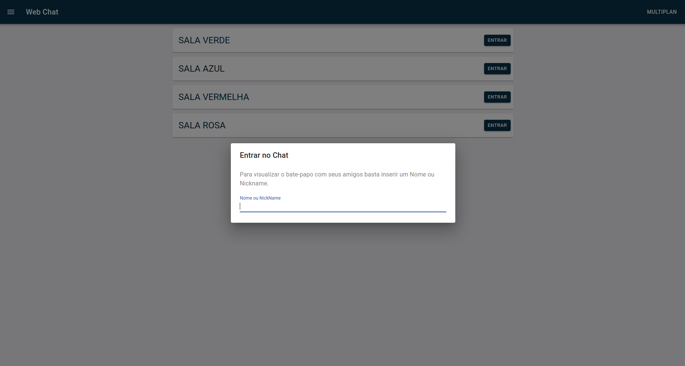
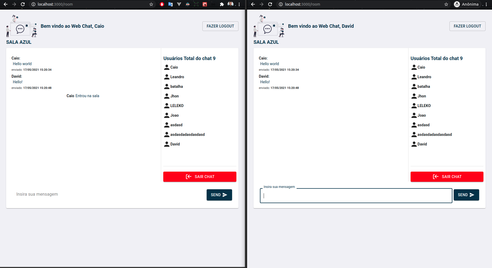

<h1 align="center"></img></h1>

# MULT-CHAT
O Projeto foi desenvolvido para criar salas de bate-papo com o intuito de ter um canal em tempo real customizado, enviar e receber 
mensagens de texto entre um numero de pessoas limitado as configurações do servidor respectivo.

# ✋🏻 Pré-requisitos
- [Node.js](https://nodejs.org/en/)
- [Yarn](https://yarnpkg.com/getting-started/install)
- [Docker](https://docs.docker.com/engine/install/ubuntu/)
- [MongoDB](https://www.mongodb.com/)

## Features
Para o desenvolvimento do projeto foi utilizada uma stack com as seguintes tecnologias:

- 💹 **Node Js** — Web framework que permite utilizar javascript tanto no frontend quanto no backend;
- ⚛️ **React Js** — Livraria Javascript para construção de interfaces;

## 🚀  Tecnologias
Backend:
-   [Node.js](https://nodejs.org/en/)
-   [Express](https://expressjs.com/pt-br/)
-   [TS Node](https://www.npmjs.com/package/ts-node-dev)
-   [React](https://pt-br.reactjs.org/)
-   [TypeScript](https://www.typescriptlang.org/)
-   [Docker](https://docs.docker.com/)
-   [WebSocket](https://socket.io/)
-   [MongoDB](https://www.mongodb.com/)

Frontend:
-   [ReactJS](https://pt-br.reactjs.org/)
-   [Axios](https://github.com/axios/axios)
-   [React icons](https://react-icons.netlify.com/#/)
-   [React router dom](https://www.npmjs.com/package/react-router-dom)
-   [MATERIAL-UI](https://material-ui.com/pt/)
-   [React Redux](https://react-redux.js.org/)

## Começando

<h1 align="center"></img></h1>

## 🔥 Instalação e execução com docker

1. Ter o docker e docker compose instalado
2. executar o comando `docker-compose up -d --build`

frontend : localhost:3000

## 🔥 Instalação e execução com yarn (Sem Docker)

1. Faça um clone desse repositório;
2. Entre na pasta `cd mult-chat`;
3. Rode `yarn` dentro das pastas backend e frontend para instalar as dependências;
4. Na pasta backend execute `yarn start` pra iniciar o servidor de desenvolvimento;
5. Na pasta frontend execute `yarn start` pra iniciar o servidor de desenvolvimento;

## 🔥 Instalação e execução com npm (Sem Docker)

1. Faça um clone desse repositório;
2. Entre na pasta cd mult-chat;
3. Rode `npm install` dentro ds pasta backend e frontend para instalar as dependências;
4. Na pasta backend execute `npm start` pra iniciar o servidor de desenvolvimento;
5. Na pasta frontend execute `npm start` pra iniciar o servidor de desenvolvimento;

Obs: ao executar o projeto sem o docker: entrar na pasta backend/src/database/index.ts e modificar o caminho do mongo de `mongodb` para `localhost`

### Insomnia 
Para testar a API do MULTI CHAT, baixe e instale o [Insomnia](https://insomnia.rest/download/).

1. Acessar Lista de usuários:
(GET) http://localhost:3333/users 

2. Inserir Usuários:
(POST) http://localhost:3333/users

body: {
     {
	"name": "exemple",
	"email": "exemple@exemple.com",
	"nickName": "exemplenick",
	"data_aniversario": "00/00/1001"
}
 }